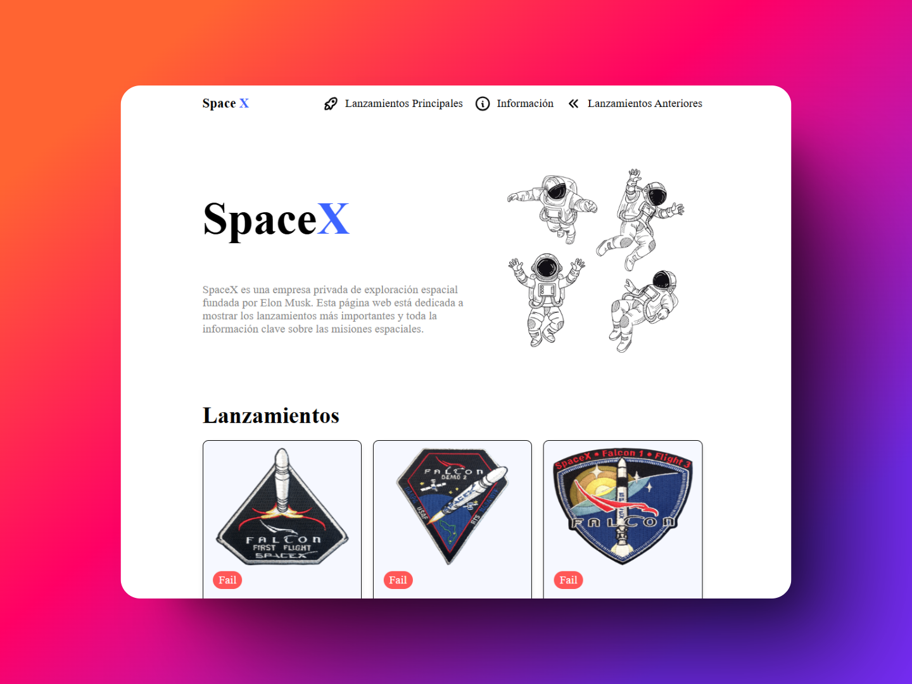

# SpaceX Launches Viewer

Este proyecto es una web sencilla creada con **Astro** que permite visualizar los lanzamientos de SpaceX utilizando su API pública. La página muestra información básica sobre los lanzamientos más recientes, como el nombre de la misión, el número de vuelo y el estado del lanzamiento.

## Descripción

La aplicación realiza una solicitud a la API de SpaceX para obtener detalles sobre los lanzamientos. Muestra cada lanzamiento en una tarjeta con el logo de la misión, el número de vuelo y el nombre de la misión, además de indicar si el lanzamiento fue exitoso o fallido.

## Características

- Visualización de lanzamientos de SpaceX en tarjetas.
- Información sobre el estado de cada lanzamiento (exitoso o fallido).
- Estilo minimalista y sencillo.
- Uso de **Astro** para la construcción de la web.

## Instalación

Para empezar con este proyecto, sigue estos pasos:

### 1. Clonar el repositorio

Primero, clona el repositorio en tu máquina local:

```bash
git clone https://github.com/tu_usuario/spaceX-launches-viewer.git
```

## Vista previa del portafolio
